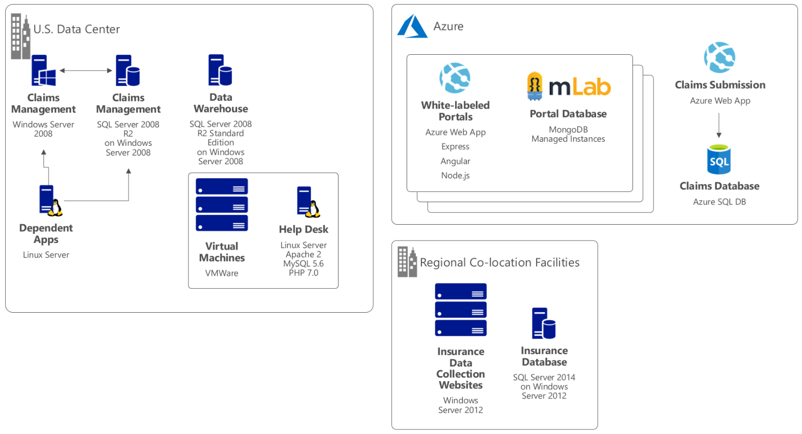

Financial Services Modernization

Design challenge facilitator guide

August 2018

Information in this document, including URL and other Internet Web site references, is subject to change without notice. Unless otherwise noted, the example companies, organizations, products, domain names, e-mail addresses, logos, people, places, and events depicted herein are fictitious, and no association with any real company, organization, product, domain name, e-mail address, logo, person, place or event is intended or should be inferred. Complying with all applicable copyright laws is the responsibility of the user. Without limiting the rights under copyright, no part of this document may be reproduced, stored in or introduced into a retrieval system, or transmitted in any form or by any means (electronic, mechanical, photocopying, recording, or otherwise), or for any purpose, without the express written permission of Microsoft Corporation.

Microsoft may have patents, patent applications, trademarks, copyrights, or other intellectual property rights covering subject matter in this document. Except as expressly provided in any written license agreement from Microsoft, the furnishing of this document does not give you any license to these patents, trademarks, copyrights, or other intellectual property.

The names of manufacturers, products, or URLs are provided for informational purposes only and Microsoft makes no representations and warranties, either expressed, implied, or statutory, regarding these manufacturers or the use of the products with any Microsoft technologies. The inclusion of a manufacturer or product does not imply endorsement of Microsoft of the manufacturer or product. Links may be provided to third party sites. Such sites are not under the control of Microsoft and Microsoft is not responsible for the contents of any linked site or any link contained in a linked site, or any changes or updates to such sites. Microsoft is not responsible for webcasting or any other form of transmission received from any linked site. Microsoft is providing these links to you only as a convenience, and the inclusion of any link does not imply endorsement of Microsoft of the site or the products contained therein.

© 2018 Microsoft Corporation. All rights reserved.

Microsoft and the trademarks listed at <https://www.microsoft.com/en-us/legal/intellectualproperty/Trademarks/Usage/General.aspx> are trademarks of the Microsoft group of companies. All other trademarks are property of their respective owners.

**Contents**

<!-- TOC -->

- [Facilitator information](#facilitator-information)
    - [Role of the facilitator](#role-of-the-facilitator)
    - [Design challenge session flow](#design-challenge-session-flow )
    - [Before the design challenge session: How to prepare](#before-the-design-challenge-session-how-to-prepare)
    - [During the design challenge session: Tips for an effective design challenge session](#during-the-design-challenge-session-tips-for-an-effective-design-challenge-session)
    - [Customer situation](#customer-situation)
    - [Customer needs](#customer-needs)
    - [Customer objections](#customer-objections)
    - [Current state architecture](#current-state-architecture)

- [Financial Services Modernization design challenge session attendee guide](#financial-services-modernization-design-challenge-session-attendee-guide)
    - [Interactive Design Challenge](#interactive-design-challenge)
    - [Design Challenge scoping and next steps](#design-challenge-scoping-and-next-steps)
    - [Architecture showcase and testing](#architecture-showcase-and-testing)

<!-- /TOC -->

# Facilitator information

Thank you for taking time to support the design challenge session as a facilitator!

## Role of the facilitator

An amazing facilitator:

-   Creates a safe environment in which learning can take place

-   Stimulates the participant's thinking

-   Involves the participant in the learning process

-   Manages the learning process (on time, on topic, and adjusting to benefit participants)

-   Ensures individual participant accountability

-   Ties it all together for the participant

-   Provides insight and experience to the learning process

-   Effectively leads role-play discussion

-   Monitors quality and appropriateness of participant deliverables

-   Effectively leads the feedback process

## Design challenge session flow 

During the design challenge, the attendees lead the customer through an Architecture Design Session. The customer is role-played by the facilitators, who are provided a script to draw answers from in answering the attendee questions during the role-play. 

During this challenge, attendees work thru the ADS and use the whiteboard to capture requirements and potential solution designs in front of the customer, in real time. 

After establishing a general solution architecture for the complete solution, attendees will work with the customer to identify a more narrowly scoped PoC that they will implement during the technology challenge. Attendees will need to balance what the customer would like to see against what they will be able to implement in the time allotted to the technology challenge. 

Once they have reached agreement with the customer on the PoC scope, the customer will leave and attendees will be provided an opportunity to present back their solution to their peers in the room. Each presentation will represent the reasoning behind the architectural decisions they made. To further strengthen the architecture, a large-group discussion will follow each presentation to proof-test it with real-world implementation experiences, identifying its potential points of failure, high-availability, and its maintainability over time.

| Phase | Task | Is Customer Present? | Time |
| --- | --- | --- | --- | 
| Interactive Design Challenge| Execute an ADS with the customer| Yes | 60 minutes |
| Design Challenge scoping and next steps |  Complete the overall solution design on the whiteboard. Identify the PoC scope and whiteboard the PoC design | Yes | 45 minutes | 
| Architecture showcase and testing | Attendee team presents solution back to room of peers, justifying design decisions and improving design based on feedback. | No | 90 minutes | 

**Outcome**

The outcome of the design challenge is that attendees have a solid solution design for the overall solution and a clear architecture for their PoC. They should be ready to present the PoC design to the customer the following day as they begin the Technology Challenge.

## Before the design challenge session: How to prepare

Before conducting your first design challenge session:

-   Read the design challenge facilitator

-   Become familiar with all key points and activities

-   Review the customer situation carefully to give yourself context for the role-play. 

-   Review the talking points and be prepared to draw from them during the role-play. Plan the points you want to stress, which questions you want to drive, and be ready to answer questions

-   Make notes to help you during the delivery

## During the design challenge session: Tips for an effective design challenge session

**Refer to the Facilitator guide** to stay on track and observe the timings.

**Do not expect to memorize every detail** of the design challenge session.

**Consider creating a "parking lot"** to record issues or questions raised that are outside the scope of the design challenge session or can be answered later. Decide how you will address these issues, so you can acknowledge them without being derailed by them.

***Have fun**! Encourage participants to have fun and share!*

**Involve your participants.** Talk and share your knowledge but always involve your participants, even while you are the one speaking.

**Ask questions** and get them to share to fully involve your group in the learning process.

**Ask first**, whenever possible. Before launching into a topic, learn your audience's opinions about it and experiences with it. Asking first enables you to assess their level of knowledge and experience, and leaves them more open to what you are presenting.

**Wait for responses**. If you ask a question such as, "What's your experience with (fill in the blank)?" then wait. Do not be afraid of a little silence. If you leap into the silence, your participants will feel you are not serious about involving them and will become passive. Give participants a chance to think, and if no one answers, patiently ask again. You will usually get a response.

### Customer situation

Contoso Ltd is an established financial services firm, providing many services including insurance solutions that it provides worldwide. Its products include accident and health insurance, life insurance, travel, home, and auto coverage.

Contoso Ltd manages data collection services for claims processing by sending mobile agents directly to the insured to gather information as part of the data collection process for claims from an insured individual. These mobile agents are based all over the world and are residents of the region in which they work. Mobile agents are managed remotely through regional corporate offices.

Contoso Ltd support staff process the incoming claims (which sometimes requires scrubbing) through the corporate website, and create a work order assigned to a mobile agent in the region of the insured.

Mobile agents log in daily to the data collection website and retrieve the list of insured customers they are responsible for visiting. They communicate directly with the insured, schedule a time for a home visit, and ultimately during that visit collect information and input it into the data collection website. The sensitive information collected always includes Personally Identifiable Information (PII) and may include Protected Health Information (PHI) about the insured customer. This data is sent over the public Internet securely over TLS (SSL).

Support staff processes complete work orders and submits results through the corporate website requiring another transfer of sensitive data.

They have a number of legacy open source web and LOB applications deployed on Linux servers. In addition, they are running SQL Server 2008 R2 on Windows Server 2008 as their database which they understand is approaching end of life.  

Contoso Ltd does not have a complete, company-wide inventory of the number of servers and applications running on legacy software and many of the systems are undocumented and not well understood by IT staff. They want to understand their current workloads and they would like to take advantage of the cloud where appropriate.

They currently operate a small data center and are running into performance as well as capacity issues and feel this is preventing them keeping up with the growth they are seeing in their business.  

**Claims Management**

The Claims Management system is one of the most critical systems at Contoso Ltd. It was originally architected when the company was much smaller. It currently runs on Windows Server 2008 R2 with a separate SQL Server 2008 backend. The application team that supports it would ultimately like to rearchitect the system for better scalability and to take better advantage of new innovations in claims management. They see cloud technologies as a good fit for this type of application but they lack the experience, expertise and time to rebuild the application right now.

It is highly complex and is leveraged by various parts of the business with many upstream and downstream dependencies. Some of these dependencies are Linux systems. 

"We are preparing for Windows and SQL Server 2008/R2 end of support and would like to better understand our options for upgrade and migration." Sloane Peterson, Contoso Ltd CIO.

**Helpdesk**

In addition the Claims Management system, their next critical application is the their customer support solution, including the Helpdesk. They have completed a cloud readiness assessment of the application and gathered the following information:

- Helpdesk software is deployed on a single VM running a traditional LAMP stack (Linux, Apache, MySQL & PHP)

- Linux Ubuntu 16.04, Apache 2, MySQL 5.6 (100GB DB), and PHP 7.0 are the current versions

- The VM is hosted on a VMWare infrastructure using 8vCPUs and 16GB of RAM. When asked about why the applications required 8vCPUs, the Contoso Ltd team stated that during busy periods the server can get overloaded. They decided to scale up the VM to handle the load when needed.

The team stated there has been downtime due to the web server not responding. When this happens, they are forced to reboot the VM (every few weeks). They have noticed error OST98744 in event log when this happens.

Customers and Partners access the system via the Internet while the Contoso Ltd support teams access the application from the internal network.

Operations is overloaded but not particularly productive, so they would like to offload some of the daily management and maintenance work (especially with their highly available database servers) so the operations team can focus more on being an asset to the company instead of a cost center that is continually maintaining and patching servers that are becoming hopelessly dated.  

Executives decided to migrate their on-premises customer support systems into Microsoft Azure. The hope is that running Linux VMs on Azure should enable Contoso Ltd to lower costs while sustaining or even increasing availability of the application.

The following objectives were put in place:

- Migrate customer support systems from on-premises to Azure and achieve cost reduction without lowering the quality-level of Contoso Ltd support operations

- With Azure Linux support, leverage infrastructure as a service (IaaS) or platform as a service (PaaS) approaches for an on-schedule, agile migration to the cloud

- Implement Azure ExpressRoute and its highly secured connection to migrate systems that had proven difficult to migrate to the cloud previously

**White-labeled Portals**

The third critical solution they would like to migrate are financial portal sites that they white label when delivering services in partnership with other enterprise customers. The VP of Engineering at Contoso Ltd, Arthur Block, has a team of 12 developers who handle all aspects of development, testing, deployment and operational management of their portal sites. Due to customer demands, they have issues with the efficiency and reliability of their development and DevOps workflows.

The white-labeled portal sites are currently hosted in Azure with the following topology and platform implementation:
-   The web sites are built with the MEAN stack (Mongo, Express, Angular, Node.js)
-   Web sites and APIs are hosted in Azure App Services
-   MongoDB is a managed service provided by mLab on Azure

Customers are considered "tenants", and each tenant is treated as a unique deployment whereby the following happens:
-   Each tenant has a database in the MongoDB cluster with its own collections
-   A copy of the most recent functional code base is taken and configured to point at the tenant database
    -   This includes a web site code base and an administrative site code base for entering content  

-   Modifications to support the customer's styles, graphics, layout, and other custom requests are applied
-   The portal owner is given access to the admin site to enter event details
    -   They have the ability to manage the content

-   The tenant's code (public portal and admin web site) is deployed to Web Apps in an App Service Plan
-   Once the portal site is live, the inevitable requests for changes to the web site pages, styles, registration requirements, and any number of custom requests begin

Arthur believes there will always be the need for custom copies of code for a particular tenant who requires a one-off custom implementation. Arthur feels that Docker containers may be a good solution to support their short-term DevOps and development agility needs, while also being the right direction once they reach a majority multi-tenant application solution.

Arthur is looking to make improvements with the following goals in mind:
-   Reduce regressions introduced in a single tenant when changes are made
    -   One of the issues with the code base is that it has many dependencies across features. Seemingly simple changes to an area of code introduce issues with layout, responsiveness, registration functionality, content refresh, and more.
    -   To avoid this, he would like to rework the core code base so that registration, email notifications and templates, content and configuration are cleanly separated from each other and from the front end
    -   Ideally, changes to individual areas will no longer require a full regression test of the site; however, given the number of sites they manage, this is not tenable
-   Improve the DevOps lifecycle
    -   The time it takes to onboard a new tenant, launch a new site for an existing tenant, and manage all the live tenants throughout the lifecycle of the conference is highly inefficient
    -   By reducing the effort to onboard customers, manage deployed sites, and monitor health, the company can contain costs and overhead as they continue to grow. This may allow for time to improve the multi-tenant platform they would like to build for long-term growth.
-   Increase visibility into system operations and health
    -   The team has little to no aggregate views of health across the web sites deployed

**Data and Data Warehouse**

The operations team would also like a long term plan to take advantage of the new advancements in SQL Server while still getting the most out of their Azure investment by minimizing the administrative overhead.

Contoso Ltd has a Microsoft SQL Server 2008 R2 Standard Edition data warehouse.
They had a significant outage last year because one of their audit tables ran out of space. They had to wait many hours to resolve the issue while their IT department scrambled to make space on an already overloaded Storage Area Network (SAN). They would like a full briefing on how to monitor that situation, so it doesn't happen again, and possible remedies if it does happen again. They would also like high availability to be built into the project plan and are wondering what additional fees that would incur.

Kathleen Sloan, the CTO of Contoso Ltd, is looking to decrease their software license fees, take advantage of a modern data warehouse, and provide a strong vision of availability for the future that will handle their momentous growth. She is also exploring the cloud and is wondering if she can make a direct migration to a cloud database or if she must stay on-premises because of her requirements. She has seen SQL Server make tremendous gains in features over the last several versions, particularly in business intelligence. Her data warehouse has slowed down as the data has increased. On one hand, this is because the data warehouse SQL Server has gotten very popular, but it's still a negative in her mind. She's concerned about the upgrade path because of all the dependencies on the data warehouse in her organization.

She is considering the public cloud to increase their agility and give them a competitive advantage, but as a heavily regulated financial services company, they are very concerned about security, compliance, and privacy. 

The head of IT constantly fails an audit where he is asked if their data warehouse encrypts data at rest. He realizes he needs to upgrade to Azure SQL Database or SQL Server Enterprise Edition and would like to include an upgrade in the POC.

Before Contoso Ltd invests in this project, they want a proof of concept that encompasses these touch points and proves that it can be successful.

**Security and Compliance**

Contoso currently hosts their insurance related systems at co-locations facilities within each geopolitical region and manages all IT operations for the systems. In the United States, they have achieved SOC 1 and SOC 2 compliance and follow required HIPAA regulations to protect PHI. Because of the new European GDPR laws, Contoso must evaluate their computing environments for compliance gaps. Contoso has concerns about maintaining their SOC 2 certification and HIPAA compliance with respect to moving to Azure. They would like to specifically address concerns about regional issues of data sovereignty for sensitive data within the context of the GDPR and want to ensure that if they move to Azure, they will be able to continue to have isolation between components.

They would also like to ensure that the corporate website and external facing web apps are sufficiently isolated and secured.

Jack Tradewinds, the CISO of Contoso Ltd, has heard a great deal of positive news about Azure and its progress in terms of security and compliance. He would like to learn more about the security features and if they can move some of their data and applications away from their on-premises datacenter. Given his long-standing relationship with Microsoft, he would like to see if Azure can meet his needs.

**AI**

Contoso Ltd is looking to build a next-generation platform for its insurance products and had identified claims processing as the first area in which they would like to focus their efforts. Their existing solution isn’t as sophisticated as it needs to be, so they’re excited about injecting cognitive services, machine learning and deep learning into their new  platform.

Currently customers submit a claim using either the website, their mobile app or by speaking with a live agent.

A claim includes the following information:

- Information about the insured (contact information, policy number, etc.)

- Free text responses describing the claim (details of what happened, what was affected, the conditions in which it occurred)

- Photographs that support the claim (photos of the insured object before the event, photos of the damage or stolen items, etc.)

When an agent (an employee or contractor of Contoso Ltd) is processing a claim, there are multiple challenges that add significantly to the cost, including the significant time it takes for an agent to read through and process the content submitted with each claim, as well as the difficulty they have in finding particular claim artifacts when returning to a claim after a while. While each claim is stored in a database, the details about the claim, including the free text responses and supporting photos, are stored as opaque attachments that are not searchable - meaning agents typically pull up the claim by the claim number or the insured's contact information and then must manually read through the attachments.

They would like to build a PoC atop of their claims submission solution they already have running in Azure (which consists of a Web App for claims submission and a SQL Database for claim storage). They believe some improvements might be possible using AI, machine learning or deep learning and would like to build a proof of concept to understand just how far they can go using these technologies.

### Customer needs 

1.  Identify migration and upgrade tools to help in assessing, migrating and optimizing the current environment

2.  Identify the major milestones in a migration plan.

3.  Need to build an inventory of their current systems and provide some organization around the various systems they have in place. The inventory should include dependencies and tiering of the applications to help in prioritizing application upgrades and migrations.

4. Migrate their existing support application to Microsoft Azure with minimal changes and minimal disruption to their service

5. Ensure that the critical systems deployed in Azure are configured for high availability, cost optimization, performance and best practices

6. Need to understand the business continuity and disaster recovery options  

7. Contoso Ltd. has a detailed support history of their client's environments. This information cannot be lost during the migration. Any data loss would be considered a migration failure.

8. Data needs to be encrypted at rest and in transit. The current system is not configured in this manner, but when moving to the cloud they need to ensure their clients privacy.

9. Enable logging across all components to support an all-encompassing monitoring solution.

10. Ensure that Azure admins utilize best practices when accessing the Azure virtual machine resources and that all logins are logged for identity theft analysis activities

11. Ensure that only authorized users can access specific Azure resources when logged into the Azure Portal

12. When specific security events are detected (such as a port scan), allow for the execution of actions to remediate, start the investigative process or prevent further information leakage or damage

13. We are looking to amplify the capabilities of our agents and improve their claims processing capabilities - not replace them. We want a solution that does the same.

### Customer objections:

1.  We have some third-party applications where we do not have complete control of the code or schema. We will not be able to upgrade these applications before the end of support. What options do we have for these applications?

2.  Some of our data has very strict regulatory constraints and cannot leave the country of origin, how do we handle this type of data in Azure? Will data be replicated or located in other countries or regions?

3. Our mission critical systems need to have an SLA from our cloud provider of no less than 99.9% for the services we use.

4. With so many platforms and tools for Docker and container orchestration, how should we choose an option for Azure?

5. Do we need to upgrade to on-premises SQL Server first or go can we go straight to Azure?

6. I heard we cannot run SQL Server Agent Jobs in Azure, is this true?

7. Can Microsoft employees or government entities access our data?

8. How does Azure protect against threats?

9. What certifications does Azure have and can Azure hosted applications meet the US and European compliance goals?

10. Is Azure flexible enough to support data sovereignty needs and issues like those referenced in GDPR articles?

11. Can we ensure continued SOC 1 and SOC 2 compliance?

12. Does Azure permit penetration testing as a part of a security assessment?

13. We are skeptical about all the hype surrounding these "AI" solutions. It's hard to know what is feasible versus what is not possible with today's technology and Azure.

14. We know that are both pre-built AI and custom AI options available. We are confused as to when to choose one over the other.

### Current State Architecture
Contoso Ltd. has provided the following logical architecture diagram that summarizes the current state of their key systems.

#  Financial Services Modernization design challenge session attendee guide

## Interactive Design Challenge

Analyze your customer's needs and design a preliminary solution.

In this phase, the "customer representatives" join attendee teams. "Customers" and attendees work through an ADS agenda,  discovering requirements (current and future state) and whiteboarding a solution. Each team will be assigned different solution scenarios. Individuals self-evaluate whiteboarding based on co-created rubric.

Timeframe: 60 minutes

**Directions:**  

Meet your table participants and facilitator. The facilitator will play the role of the customer in an ADS with a team of attendees.

## Design Challenge scoping and next steps

Complete the overall solution design on the whiteboard and work with the customer to identify the PoC, scope the PoC and whiteboard the PoC design. 

Timeframe: 45 minutes

**Directions:**

Attendee teams and "customer representatives" make first cut on PoC implementation scope and next steps based on customer constraints for their scenario. 

## Architecture showcase and testing

Attendee team presents solution back to room of peers, justifying design decisions and improving design based on feedback.

Timeframe: 90 minutes

**Directions**

Attendee teams present back their architecture and first-pass implementation plan to room. Each presentation will represent the reasoning behind the architectural decisions they made. To further strengthen the architecture, a large-group discussion will follow each presentation to proof-test it with real-world implementation experiences, identifying its potential points of failure, high-availability, and its maintainability over time.

Your goal is to be prepared to present your solution architecture and planned PoC back to the customer the following day to get approval from the customer to proceed with the PoC implementation.

