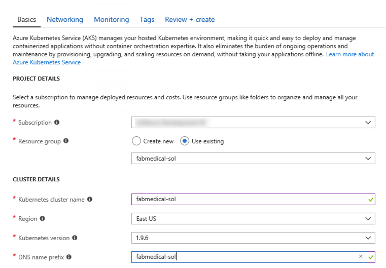
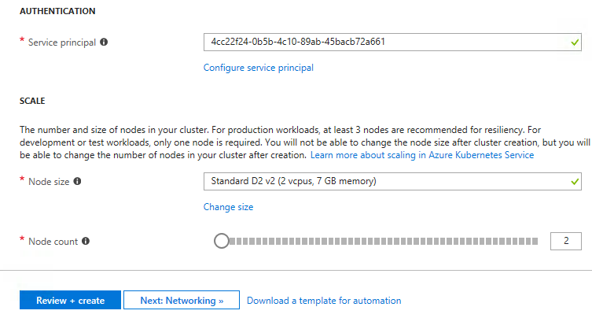
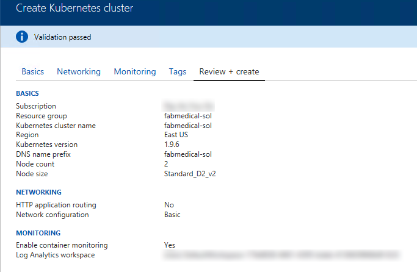
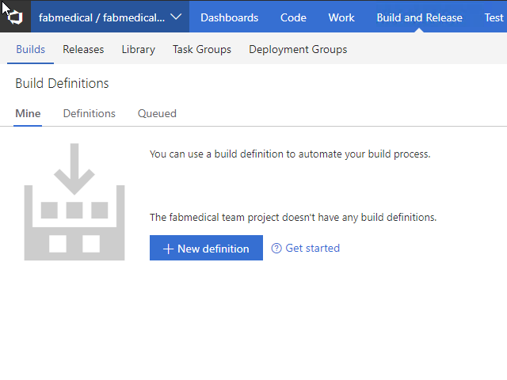
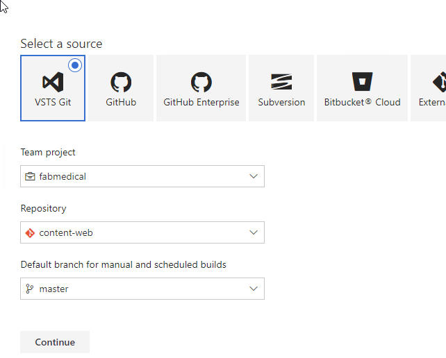
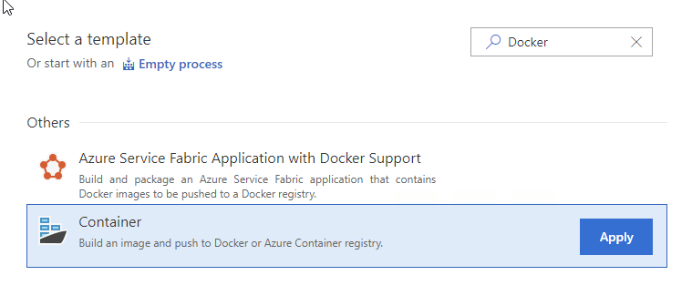

# Containerization PoC starter artifacts

These starter artifacts provided by Contoso might help you accelerate your PoC efforts for containerization.

## What the starter contains

- The following 3 Docker containers and Node.js project source files:
  - content-api
  - content-init
  - content-web
- Mongo DB

Each tenant will have the following containers:

- **Conference Web site**: the SPA application that will use configuration settings to handle custom styles for the tenant

- **Admin Web site**: the SPA application that conference owners use to manage conference configuration details, manage attendee registrations, manage campaigns and communicate with attendees

- **Registration service**: the API that handles all registration activities creating new conference registrations with the appropriate package selections and associated cost

- **Email service**: the API that handles email notifications to conference attendees during registration, or when the conference owners choose to engage the attendees through their admin site

- **Config service**: the API that handles conference configuration settings such as dates, locations, pricing tables, early bird specials, countdowns, and related

- **Content service**: the API that handles content for the conference such as speakers, sessions, workshops, and sponsors

## Starter setup

Setup will take around **one hour** to complete. Consider starting with this section on day one, then the following section (How to use the starter) on day two.

What you need to get started is the following:

1.  Microsoft Azure subscription must be pay-as-you-go or MSDN

    - Trial subscriptions will _not_ work

    - You must have rights to create a service principal as discussed in Task 9: Create a Service Principal --- and this typically requires a subscription owner to log in. You may have to ask another subscription owner to login to the portal and execute that step ahead of time if you do not have the rights.

    - You must have enough cores available in your subscription to create the build agent and Azure Kurbernetes Service cluster in Task 5: Create a build agent VM and Task 10: Create an Azure Kubernetes Service cluster. You'll need eight cores if following the exact instructions in the lab, more if you choose additional agents or larger VM sizes. If you execute the steps required before the lab, you will be able to see if you need to request more cores in your sub.

2.  A VisualStudio.com account

3.  Local machine or a virtual machine configured with:

    - A browser, preferably Chrome for consistency with the lab implementation tests

    - Command prompt

      i. On Windows, you will be using Bash on Ubuntu on Windows, hereon referred to as WSL

      ii. On Mac, all instructions should be executed using bash in Terminal

### Task 1: Resource Group

You will create an Azure Resource Group to hold most of the resources that you create in this hands-on lab. This approach will make it easier to clean up later. You will be instructed to create new resources in this Resource Group during the remaining exercises.

1.  In your browser, navigate to the **Azure Portal** (<https://portal.azure.com>)

2.  Select **+ Create a resource** in the navigation bar at the left

    

3.  In the Search the Marketplace search box, type \"Resource group\" and press Enter

    

4.  Select **Resource group** on the Everything blade and select **Create**

    

5.  On the new Resource group blade, set the following:

    a. Resource group name: Enter something like "fabmedical-SUFFIX", as shown in the following screenshot

    b. Subscription: Select the subscription you will use for all the steps during the lab

    c. Resource group location: Choose a region where all Azure Container Registry SKUs are available, which is currently East US, West Central US, or West Europe, and remember this for future steps so that the resources you create in Azure are all kept within the same region.

    

    d. Select **Create**

6.  When this completes, your Resource Group will be listed in the Azure Portal

    

### Task 2: Create a Windows 10 Development VM

You will follow these steps to create a development VM (machine) for the following reasons:

- If your operating system is earlier than Windows 10 Anniversary Update, you will need it to work with WSL as instructed in the lab

- If you are not sure if you set up WSL correctly, given there are a few ways to do this, it may be easier to create the development machine for a predictable experience

**NOTE: Setting up the development machine is optional for Mac OS since you will use Terminal for commands. Setting up the development machine is also optional if you are certain you have a working installation of WSL on your current Windows 10 VM.**

In this section, you will create a Windows 10 VM to act as your development machine. You will install the required components to complete the lab using this machine. You will use this machine instead of your local machine to carry out the instructions during the lab.

1.  From the Azure Portal, select **+ Create a resource**, type "**Windows 10**" in the Search the marketplace text box and press **Enter**

    

2.  Select **Windows 10 Pro N, Version 1709** and select **Create**

3.  On the Basics blade of the Virtual Machine setup, set the following:

    - **Name**: Provide a unique name, such as "fabmedicald-SUFFIX" as shown in the following screenshot

    - **VM disk type**: Leave as SSD

    - **User name**: Provide a user name, such as "adminfabmedical"

    - **Password**: Provide a password, such as "Password\$123"

    - **Confirm password**: Confirm the previously entered password

    - **Subscription**: Choose the same subscription you are using for all your work

    - **Resource group**: Choose Use existing and select the resource group you created previously

    - **Location**: Choose the same region that you did before

    - Select **OK** to complete the Basics blade

    

4.  From the Size blade search for "DS2_v2", choose **D2S_V2 Standard** and **Select**

    

5.  From the Settings blade, accept the default values for all settings and select **OK**

6.  From the Create blade, you should see that validation passed and select **Create**

    

7.  The VM will begin deployment to your Azure subscription

    

8.  Once provisioned, you will see the VM in your list of resources belonging to the resource group you created previously and select the new VM

    

9.  In the Overview area for the VM, select Connect to establish a Remote Desktop Connection (RDP) for the VM

    

10. Complete the steps to establish the RDP session and ensure that you are connected to the new VM

### Task 3: Install WSL (Bash on Ubuntu on Windows)

**NOTE: If you are using a Windows 10 development machine, follow these steps. For Mac OS you can ignore this step since you will be using Terminal for all commands.**

You will need WSL to complete various steps. A complete list of instructions for supported Windows 10 versions is available on this page:

<https://docs.microsoft.com/en-us/windows/wsl/install-win10>

### Task 4: Create an SSH key

In this section, you will create an SSH key to securely access the VMs you create during the upcoming exercises.

1.  Open a WSL command window

    

    or

    

2.  From the command line, enter the following command to ensure that a directory for the SSH keys is created. You can ignore any errors you see in the output.

```bash
    mkdir .ssh
```

3.  From the command line, enter the following command to generate an SSH key pair. You can replace "admin" with your preferred name or handle.

```bash
   ssh-keygen -t RSA -b 2048 -C admin@fabmedical
```

4.  You will be asked to save the generated key to a file. Enter \".ssh/fabmedical\" for the name.

5.  Enter a passphrase when prompted, and don't forget it!

6.  Because you entered ".ssh/fabmedical", the file will be generated in the ".ssh" folder in your user folder, where WSL opens by default.

7.  Keep this WSL window open and remain in the default directory, you will use it in later tasks

    

### Task 5: Create a build agent VM

In this section, you will create a Linux VM to act as your build agent. You will install Docker to this VM once it is set up, and you will use this VM during the lab to develop and deploy.

**NOTE: You can set up your local machine with Docker however the setup varies for different versions of Windows. For this lab, the build agent approach simply allows for predictable setup.**

1. From the Azure Portal, select **+ Create a resource**, type "**Ubuntu**" in the Search the marketplace text box and press **Enter**

   

2. Select **Ubuntu Server 16.04 LTS** and select **Create**

3. On the Basics blade of the Virtual Machine setup, set the following:

   - **Name**: Provide a unique name, such as "fabmedical-SUFFIX" as shown in the following screenshot

   - **VM disk type**: Leave as SSD

   - **User name**: Provide a user name, such as "adminfabmedical"

   - **Authentication** **type**: Leave as SSH public key

   - **SSH public key**: From your local machine, copy the public key portion of the SSH key pair you created previously, to the clipboard

     - From WSL, verify you are in your user directory shown as "**\~"**. This command will take you there:

       ```bash
       cd ~
       ```

     - Type the following command at the prompt to display the public key that you generated.

       ```bash
       cat .ssh/fabmedical.pub
       ```

       

     - Copy the entire contents of the file to the clipboard.

       ```bash
       cat .ssh/fabmedical.pub | clip.exe
       ```

     - Paste this value in the SSH public key textbox of the blade.

   - **Login with Azure Active Directory**: Leave disabled

   - **Subscription**: Choose the same subscription you are using for all your work

   - **Resource group**: Choose Use existing and select the resource group you created previously

   - **Location**: Choose the same region that you did before

   - Select **OK** to complete the Basics blade

   

4. From the Size blade search for "D2S_v3" and **Select**

   

5. From the Settings blade, accept the default values for most settings and select "SSH (22)" as a public inbound port, then select **OK**

   

6. From the Create blade, you should see that validation passed and select **Create**

   

7. The VM will begin deployment to your Azure subscription

   

8. Once provisioned, you will see the VM in your list of resources belonging to the resource group you created previously

   

### Task 6: Connect securely to the build agent

In this section, you will validate that you can connect to the new build agent VM.

1.  From the Azure portal, navigate to the Resource Group you created previously and select the new VM, fabmedical-SUFFIX

2.  In the Overview area for the VM, take note of the public IP address for the VM

    

3.  From your local machine, return to your open WSL window and make sure you are in your user directory **\~** where the key pair was previously created. This command will take you there:

    ```bash
    cd ~
    ```

4.  Connect to the new VM you created by typing the following command

    ```bash
     ssh -i [PRIVATEKEYNAME] [BUILDAGENTUSERNAME]@[BUILDAGENTIP]
    ```

    Replace the bracketed values in the command as follows:

    - [PRIVATEKEYNAME]: Use the private key name ".ssh/fabmedical," created above.

    - [BUILDAGENTUSERNAME]: Use the username for the VM, such as adminfabmedical.

    - [BUILDAGENTIP]: The IP address for the build agent VM, retrieved from the VM Overview blade in the Azure Portal.

    ```bash
    ssh -i .ssh/fabmedical adminfabmedical@52.174.141.11
    ```

5.  When asked to confirm if you want to connect, as the authenticity of the connection cannot be validated, type "yes"

6.  When asked for the passphrase for the private key you created previously, enter this value

7.  You will connect to the VM with a command prompt such as the following. Keep this command prompt open for the next step.

    adminfabmedical\@fabmedical-SUFFIX:~$

    

**NOTE: If you have issues connecting, you may have pasted the SSH public key incorrectly. Unfortunately, if this is the case, you will have to recreate the VM and try again.**

### Task 7: Complete the build agent setup

In this task, you will update the packages and install Docker engine.

1. Go to the WSL window that has the SSH connection open to the build agent VM

2. Update the Ubuntu packages and install curl and support for repositories over HTTPS in a single step by typing the following in a single line command. When asked if you would like to proceed, respond by typing "y" and pressing enter.

   ```bash
   sudo apt-get update && sudo apt install apt-transport-https ca-certificates curl software-properties-common
   ```

3. Add Docker's official GPG key by typing the following in a single line command

   ```bash
   curl -fsSL https://download.docker.com/linux/ubuntu/gpg | sudo apt-key add -
   ```

4. Add Docker's stable repository to Ubuntu packages list by typing the following in a single line command

   ```bash
   sudo add-apt-repository "deb [arch=amd64] https://download.docker.com/linux/ubuntu $(lsb_release -cs) stable"
   ```

5. Update the Ubuntu packages and install Docker engine, node.js and the node package manager in a single step by typing the following in a single line command. When asked if you would like to proceed, respond by typing "y" and pressing enter.

   ```bash
   sudo apt-get update && sudo apt install docker-ce nodejs npm mongodb-clients
   ```

6. Now, upgrade the Ubuntu packages to the latest version by typing the following in a single line command. When asked if you would like to proceed, respond by typing "y" and pressing enter.

   ```bash
   sudo apt-get upgrade
   ```

7. Install `docker-compose`

   ```bash
   sudo curl -L https://github.com/docker/compose/releases/download/1.21.2/docker-compose-`uname -s`-`uname -m` -o /usr/local/bin/docker-compose
   sudo chmod +x /usr/local/bin/docker-compose
   ```

8. When the command has completed, check the Docker version installed by executing this command. The output may look something like that shown in the following screen shot. Note that the server version is not shown yet, because you didn't run the command with elevated privileges (to be addressed shortly).

   ```bash
   docker version
   ```

   

9. You may check the versions of node.js and npm as well, just for information purposes, using these commands

   ```bash
   nodejs --version

   npm -version
   ```

10. Install `bower`

    ```bash
    sudo npm install -g bower
    sudo ln -s /usr/bin/nodejs /usr/bin/node
    ```

11. Add your user to the Docker group so that you do not have to elevate privileges with sudo for every command. You can ignore any errors you see in the output.

    ```bash
    sudo usermod -aG docker $USER
    ```

    

12. In order for the user permission changes to take effect, exit the SSH session by typing 'exit', then press \<Enter\>. Repeat the commands in Task 6: Connect securely to the build agent from step 4 to establish the SSH session again.

13. Run the Docker version command again, and note the output now shows the server version as well

    

14. Run a few Docker commands

    - One to see if there are any containers presently running

    ```bash
    docker container ls
    ```

    - One to see if any containers exist whether running or not

    ```bash
    docker container ls -a
    ```

15. In both cases, you will have an empty list but no errors running the command. Your build agent is ready with Docker engine running properly.

    

### Task 8: Create an Azure Container Registry

You deploy Docker images from a registry. To complete the hands-on lab, you will need access to a registry that is accessible to the Azure Kubernetes Service cluster you are creating. In this task, you will create an Azure Container Registry (ACR) for this purpose, where you push images for deployment.

1.  In the [Azure Portal](https://portal.azure.com/), select **+ Create a resource**, **Containers**, then click **Azure Container Registry**.

    

2.  On the Create container registry blade, enter the following:

    - Registry name: Enter a name, such as "fabmedicalSUFFIX", as shown in the following screenshot.

    - Subscription: Choose the same subscription you are using for all your work.

    - Resource group: Choose Use existing and select the resource group you created previously.

    - Location: Choose the same region that you did before.

    - Admin user: Select Enable.

    - SKU: Select Standard.

      

3.  Select **Create**

4.  Navigate to your ACR account in the Azure Portal. As this is a new account, you will not see any repositories yet. You will create these during the hands-on lab.

    

### Task 9: Create a Service Principal

Azure Kubernetes Service requires an Azure Active Directory service principal to interact with Azure APIs. The service principal is needed to dynamically manage resources such as user-defined routes and the Layer 4 Azure Load Balancer. The easiest way to set up the service principal is using the Azure cloud shell.

**NOTE: By default, creating a service principal in Azure AD requires account owner permission. You may have trouble creating a service principal if you are not the account owner.**

1.  Open cloud shell by selecting the cloud shell icon in the menu bar

    

2.  The cloud shell will open in the browser window. Choose "Bash (Linux)" if prompted or use the left-hand dropdown on the shell menu bar to choose "Bash" (as shown).

    

3.  Before completing the steps to create the service principal, you should make sure to set your default subscription correctly. To view your current subscription type:

    ```bash
    az account show
    ```

    

4.  To list all of your subscriptions, type:

    ```bash
    az account list
    ```

    

5.  To set your default subscription to something other than the current selection, type the following, replacing {id} with the desired subscription id value:

    ```bash
    az account set --subscription {id}
    ```

6.  To create a service principal, type the following command, replacing {id} with your subscription identifier, and replacing suffix with your chosen suffix to make the name unique:

    ```bash
    az ad sp create-for-rbac --role="Contributor" --scopes="/subscriptions/{id}" --name="Fabmedical-sp-{SUFFIX}"
    ```

7.  The service principal command will produce output like this. Copy this information; you will need it later.

    

### Task 10: Create an Azure Kubernetes Service cluster

In this task, you will create your Azure Kubernetes Service cluster. You will use the same SSH key you created previously to connect to this cluster in the next task.

1.  From the Azure Portal, select **+ Create a resource**, **Containers** and select **Kubernetes Service**

    

2.  In the Basics blade provide the information shown in the screenshot that follows:

    > Note: you may need to scroll to see all values.

    - **Subscription**: Choose your subscription which you have been using throughout the lab.
    - **Resource group**: Select the resource group you have been using through the lab.
    - **Name**: Enter fabmedical-SUFFIX.
    - **Region**: Choose the same region as the resource group.
    - **Kubernetes version**: 1.9.6.
    - **DNS Prefix**: Enter fabmedical-SUFFIX.

      

    - Configure your service principal

      - **Service principal client ID**: Use the service principal “appId” from the previous step.
      - **Service principal client secret**: Use the service principal “password” from the previous step.

        

    - Configure your VM size

      - Click "Change Size"
      - Search for "D2s_v3"
      - Select "D2s_v3"

        

    - Set the Node Count to 2

      

3.  Select "Next: Networking".
4.  Keep the defaults and select "Next: Monitoring"
5.  Keep the defaults and select "Next: Tags"
6.  Keep the defaults and select "Review + create"
7.  You should see that validation passed; select "Create".

8.  On the Summary blade, you should see that validation passed; select **OK**

    

9.  The Azure Kubernetes Service cluster will begin deployment to your Azure subscription. You should see a successful deployment notification when the cluster is ready. It can take up to 10 minutes before your Azure Kubernetes Service cluster is listed in the Azure Portal. You can proceed to the next step while waiting for this to complete, then return to view the success of the deployment.

    

**NOTE: If you experience errors related to lack of available cores, you may have to delete some other compute resources or request additional cores to your subscription and then try this again.**

### Task 11: Install Azure CLI

In later exercises, you will need the Azure CLI 2.0 to connect to your Kubernetes cluster and run commands from your local machine. A complete list of instructions for supported platforms is available on this page:

<https://docs.microsoft.com/en-us/cli/azure/install-azure-cli?view=azure-cli-latest>

1.  For MacOS -- use homebrew

    ```bash
    brew update

    brew install azure-cli
    ```

2.  For Windows -- using WSL _on your local machine (not the build agent)_

    ```bash
    AZ_REPO=$(lsb_release -cs)
    echo "deb [arch=amd64] https://packages.microsoft.com/repos/azure-cli/ $AZ_REPO main" | sudo tee /etc/apt/sources.list.d/azure-cli.list

    curl -L https://packages.microsoft.com/keys/microsoft.asc | sudo apt-key add -

    sudo apt-get install apt-transport-https
    sudo apt-get update && sudo apt-get install azure-cli
    ```

### Task 12: Install Kubernetes CLI

In later exercises, you will need the Kubernetes CLI (kubectl) to deploy to your Kubernetes cluster and run commands from your local machine.

1.  Install the Kubernetes client using Azure CLI

    ```bash
    az login

    sudo az acs kubernetes install-cli --install-location /usr/local/bin/kubectl
    ```

### Task 13: Download the FabMedical starter files

FabMedical has provided starter files for you. They have taken a copy of one of their websites, for their customer Contoso Neuro, and refactored it from a single node.js site into a website with a content API that serves up the speakers and sessions. This is a starting point to validate the containerization of their websites. They have asked you to use this to help them complete a POC that validates the development workflow for running the website and API as Docker containers and managing them within the Azure Kubernetes Service environment.

1.  From WSL, download the starter files by typing the following curl instruction (case sensitive):

    ```bash
    curl -L -o FabMedical.tgz http://bit.ly/2uhZseT
    ```

2.  Create a new directory named FabMedical by typing in the following command:

    ```bash
    mkdir FabMedical
    ```

3.  Unpack the archive with the following command. This command will extract the files from the archive to the FabMedical directory you created. The directory is case sensitive when you navigate to it.

    ```bash
    tar -C FabMedical -xzf FabMedical.tgz
    ```

4.  Navigate to FabMedical folder and list the contents

    ```bash
    cd FabMedical

    ll
    ```

5.  You'll see the listing includes three folders, one for the web site, another for the content API and one to initialize API data

    ```bash
    content-api/
    content-init/
    content-web/
    ```

6.  Next log into your VisualStudio.com account

    If this is your first time logging into this account you will be taken through a first-run experience

    - Confirm your contact information and select next
    - Select "Create new account"
    - Enter a fabmedical-SUFFIX for your account name and select Continue

7.  Create repositories to host the code

    - Select the icon in the top left corner to return to the account home page

      

    - Select "New Project"
      - Enter fabmedical as the project name
      - Select "Create"
    - Once the project creation has completed, select "Code"

    - Use the repository dropdown to create a new repository by selecting "+ New repository"

      

    - Enter "content-web" as the repository name

    - Once the project is created click "Generate Git credentials"

      

      - Enter a password
      - Confirm the password
      - Select "Save Git Credentials"

    - Using your WSL window, initialize a new git repository

      ```bash
      cd content-web
      git init
      git add .
      git commit -m "Initial Commit"
      ```

    - Setup your VisualStudio.com repository as a new remote the push. You can copy the commands to do this from your browser. Paste these commands into your WSL window.

      

      - When prompted, enter your VisualStudio.com username and the git credentials password you created earlier in this task

    - Use the repository dropdown to create a second repository called "content-api"

      - Using your WSL window, initialize a new git repository in the content-api directory.

        ```bash
        cd ../content-api
        git init
        git add .
        git commit -m "Initial Commit"
        ```

      - Setup your VisualStudio.com repository as a new remote the push. Use the repository dropdown to switch to the "content-api" repository. You can then copy the commands for the setting up the content-api repository from your browser. Paste these commands into your WSL window.

      - When prompted, enter your VisualStudio.com username and the git credentials password you created earlier in this task

    - Use the repository dropdown to create a third repository called "content-init"

      - Using your WSL window, initialize a new git repository in the content-init directory

        ```bash
        cd ../content-init
        git init
        git add .
        git commit -m "Initial Commit"
        ```

      - Setup your VisualStudio.com repository as a new remote the push. Use the repository dropdown to switch to the "content-init" repository. You can then copy the commands for the setting up the content-init repository from your browser. Paste these commands into your WSL window.

      - When prompted, enter your VisualStudio.com username and the git credentials password you created earlier in this task

8.  Clone your repositories to the build agent

    - From WSL, connect to the build agent VM as you did previously in Task 6: Connect securely to the build agent using the SSH command.

    - In your browser, switch to the "content-web" repository and click "Clone" in the right corner.

      

    - Copy the repository url.

    - Use the repository url to clone the content-web code to your build agent machine.

      ```bash
      git clone <REPOSITORY_URL>
      ```

    - In your browser, switch to the "content-api" repository and select "Clone" to see and copy the repository url

    - Use the repository url and `git clone` to copy the content-api code to your build agent

    - In your browser, switch to the "content-init" repository and select "Clone" to see and copy the repository url

    - Use the repository url and `git clone` to copy the content-init code to your build agent

**NOTE: Keep this WSL window open as your build agent SSH connection. You will later open new WSL sessions to other machines.**

## How to use the starter

> **Note:** Below is a summary of steps you can follow to use the starter files. Detailed step-by-step instructions follow within the **How to use the starter step-by-step** section.

**NOTE: Complete these tasks from the WSL window with the build agent session.**

First, make sure you can run the application successfully before applying changes to run it as a Docker application.

1. On the build agent VM create a new Docker network named "fabmedical"

1. Run mongodb as a container, and be sure it is accessible from services running on the same host

1. Run the content init application by navigating to the content-init directory and running these commands:

   ```bash
   npm install
   nodejs server.js
   ```

1. Run the API and web applications in that order by navigating to their respective folders and running these commands:

   ```bash
   npm install
   nodejs server.js &
   ```

1. Test the results by curling these URLs and observing the JSON responses:

   API Application:

   ```bash
   curl http://localhost:3001/speakers
   ```

   Web Application:

   ```bash
   curl http://localhost:3000
   ```

### Enable browsing to the web site

Open a port range on the agent VM so that you can browse to the application for testing.

1. From the Azure portal, select the Network Security Group associated with the build agent VM. Create an inbound security rule to allow TCP calls over port range 3000-3010.

1. Find the IP address for the VM and browse to that IP address with port 3000.

1. You can browse to the website and see the speakers and session pages; you can reach the web application from a browser and correctly open the port on the agent VM

1. Once you have seen the website running, you can stop the running node processes with this command:

   ```bash
   killall nodejs
   ```

### Create a Dockerfile

Create a new Dockerfile that will be used to run the API as a containerized application.

**NOTE: You will be working in a Linux VM without friendly editor tools. You must follow the steps very carefully to work with Vim for a few editing exercises if you are not already familiar with Vim.**

1. From the content-api folder, using Vim create a new file named Dockerfile

1. Create a multi-stage Dockerfile based on the node:argon image for build stage(s) and node:alpine for the deployable artifact

1. Include instructions to copy the source files for the application to the image and to run npm install

1. Expose port 3001 and put the startup command npm

1. Verify the file contents, to ensure it saved as expected

### Create Docker images

Create Docker images for the application -- one for the API and another for the web application. Each image will be created via Docker commands that rely on a Dockerfile.

1. From the content-api directory, build a Docker image using the Dockerfile you created

1. From the content-web directory, build a Docker image with the existing Dockerfile in the folder

1. Once both images are successfully built, you will see three images now exist when you run the Docker images command. One for API, one for web, and another for node.

### Run a containerized application

The web application container will be calling endpoints exposed by the API application container. Create a bridge network so that containers can communicate with one another, and then launch the images you created as containers in that network.

1. Start the API container with this command

   ```bash
    docker run --name api --net fabmedical -p 3001:3001 content-api
   ```

1. Diagnose the failure with the api container and resolve by setting the MONGODB_CONNECTION environment variable within the container

1. Start the API and web containers with these commands:

   ```bash
   docker run --name web --net fabmedical -P -d content-web
   ```

1. Test the API application by curling the speakers URL once again

1. Test the web application by curling the site, but using the dynamic port assigned to the container from the run command

### Setup environment variables

Configure the web container to communicate with the API container using an environment variable. You will modify the web application to read the URL from the environment variable, rebuild the Docker image, and then run the container again to test connectivity.

1. From WSL, stop and remove the web container

1. Edit content-web\\data-access\\index.js and locate the TODO item and modify the code so that the contentApiUrl variable will be set to an environment variable

1. Edit the Dockerfile in content-web to add an environment variable CONTENT_API_URL matching http://localhost:3001

1. Rebuild the web Docker image

1. Create and start the image, passing the correct URI to the API container as an environment variable, and then check the port that the container is running on

   ```bash
   docker run --d --P --name web --net fabmedical --e CONTENT_API_URL=http://api:3001 content-web
   ```

1. Curl the speakers path again, using the port assigned to the web container

1. Stop and restart the container so that it uses port 3000 and then browse to the URL at the build agent IP address with that port to view the web application

1. Stop and remove all the running docker containers, including the mongo container

1. Create a docker-compose yaml file that will run all containers together. Make sure all dependencies are considered so that the containers start in the correct order.

1. Update the docker-compose solution to initialize and persist mongodb data

1. Check the results in the browser, the speaker and session data is now available

## How to use the starter step-by-step

**Duration**: 40 minutes

In this exercise, you will take the starter files and run the node.js application as a Docker application. You will create a Dockerfile, build Docker images, and run containers to execute the application.

**NOTE: Complete these tasks from the WSL window with the build agent session.**

### Task 1: Test the application

The purpose of this task is to make sure you can run the application successfully before applying changes to run it as a Docker application.

1. From the WSL window, connect to your build agent if you are not already connected

2. Type the following command to create a Docker network named "fabmedical"

    ```bash
    docker network create fabmedical
    ```

3. Run an instance of mongodb to use for local testing

    ```bash
    docker run --name mongo --net fabmedical -p 27017:27017 -d mongo
    ```

4. Confirm that the mongo container is running and ready

    ```bash
    docker container list
    docker logs mongo
    ```


    

5. Connect to the mongo instance using the mongo shell and test some basic commands

    ```bash
    mongo
    ```

    ```text
    show dbs
    quit()
    ```

    

6. To initialize the local database with test content, first navigate to the content-init directory and run npm install

    ```bash
    cd content-init
    npm install
    ```

7. Initialize the database

    ```bash
    nodejs server.js
    ```

    

8. Confirm that the database now contains test data

    ```bash
    mongo
    ```

    ```text
    show dbs
    use contentdb
    show collections
    db.speakers.find()
    db.sessions.find()
    quit()
    ```

    This should produce output similar to the following:

    

9. Now navigate to the content-api directory and run npm install

    ```bash
    cd ../content-api
    npm install
    ```

10. Start the API as a background process

    ```bash
    nodejs ./server.js &
    ```

    

11. Press ENTER again to get to a command prompt for the next step

12. Test the API using curl. You will request the speakers content, and this will return a JSON result.

    ```bash
    curl http://localhost:3001/speakers
    ```

13. Navigate to the web application directory, run npm install and bower install, and then run the application as a background process as well. Ignore any warnings you see in the output; this will not affect running the application.

    ```bash
    cd ../content-web
    npm install
    bower install
    nodejs ./server.js &
    ```

    

14. Press ENTER again to get a command prompt for the next step

15. Test the web application using curl. You will see HTML output returned without errors.

    ```bash
    curl http://localhost:3000
    ```

16. Leave the application running for the next task

17. If you received a JSON response to the /speakers content request and an HTML response from the web application, your environment is working as expected

### Task 2: Enable browsing to the web application

In this task, you will open a port range on the agent VM so that you can browse to the web application for testing.

1. From the Azure portal select the resource group you created named fabmedical-SUFFIX

2. Select the Network Security Group associated with the build agent from your list of available resources

    

3. From the Network interface essentials blade, select **Inbound security rules**

    

4. Select **Add** to add a new rule

    

5. From the Add inbound security rule blade, enter the values as shown in the screenshot below:

    - **Source**: Any

    - **Source port ranges**:

    - **Destination**: Any

    - **Destination Port Ranges**: 3000-3010

    - **Protocol**: Any

    - **Action**: Allow

    - **Priority**: Leave at the default priority setting

    - **Name**: Enter "allow-app-endpoints"

        

6. Select **OK** to save the new rule

    

7. From the resource list shown in step 2, select the build agent VM named fabmedical-SUFFIX

    

8. From the Virtual Machine blade overview, find the IP address of the VM

    

9. Test the web application from a browser. Navigate to the web application using your build agent IP address at port 3000.

    ```text
    http://[BUILDAGENTIP]:3000

    EXAMPLE: http://13.68.113.176:3000
    ```

10. Select the Speakers and Sessions links in the header. You will see the pages display the HTML version of the JSON content you curled previously.

11. Once you have verified the application is accessible through a browser, go to your WSL window and stop the running node processes.

    ```bash
    killall nodejs
    ```

### Task 3: Create a Dockerfile

In this task, you will create a new Dockerfile that will be used to run the API application as a containerized application.

**NOTE: You will be working in a Linux VM without friendly editor tools. You must follow the steps very carefully to work with Vim for a few editing exercises if you are not already familiar with Vim.**

1. From WSL, navigate to the content-api folder. List the files in the folder with this command. The output should look like the screenshot below.

    ```bash
    cd ../content-api
    ll
    ```

    

2. Create a new file named "Dockerfile" and note the casing in the name. Use the following Vim command to create a new file. The WSL window should look as shown in the following screenshot.

    ```bash
    vi Dockerfile
    ```

    

3. Select "i" on your keyboard. You'll see the bottom of the window showing INSERT mode.

    

4. Type the following into the file. These statements produce a Dockerfile that describes the following:

    - The base stage includes environment setup which we expect to change very rarely, if at all

      - Creates a new Docker image from the base image node:alpine. This base image has node.js on it and is optimized fro small size.

      - Add `curl` to the base image to support Docker health checks

      - Creates a directory on the image where the application files can be copied

      - Exposes application port 3001 to the container environment so that the application can be reached at port 3001

    - The build stage contains all the tools and intermediate files needed to create the application

      - Creates a new Docker image from node:argon

      - Creates a directory on the image where the application files can be copied.

      - Copies package.json to the working directory

      - Runs npm install to initialize the node application environment

      - Copies the source files for the application over to the image

    - The final stage combines the base image with the build output from the build stage

      - Sets the working directory to the application file location

      - Copies the app files from the build stage

      - Indicates the command to start the node application when the container is run

    **NOTE: Type the following into the editor, as you may have errors with copying and pasting.**

    ```Dockerfile
    FROM node:alpine AS base
    RUN apk -U add curl
    WORKDIR /usr/src/app
    EXPOSE 3001

    FROM node:argon AS build
    WORKDIR /usr/src/app

    # Install app dependencies
    COPY package.json /usr/src/app/
    RUN npm install

    # Bundle app source
    COPY . /usr/src/app

    FROM base AS final
    WORKDIR /usr/src/app
    COPY --from=build /usr/src/app .
    CMD [ "npm", "start" ]
    ```

5. When you are finished typing, hit the Esc key and type ":wq" and hit the Enter key to save the changes and close the file

    ```bash
    <Esc>
    :wq
    <Enter>
    ```

6. List the contents of the folder again to verify that the new Dockerfile has been created

    ```bash
    ll
    ```

    

7. Verify the file contents to ensure it was saved as expected. Type the following command to see the output of the Dockerfile in the command window.

    ```bash
    cat Dockerfile
    ```

### Task 4: Create Docker images

-In this task, you will create Docker images for the application --- one for the API application and another for the web application. Each image will be created via Docker commands that rely on a Dockerfile.

1. From WSL, type the following command to view any Docker images on the VM. The list will only contain the mongodb image downloaded earlier.

    ```bash
    docker images
    ```

2. From the content-api folder containing the API application files and the new Dockerfile you created, type the following command to create a Docker image for the API application. This command does the following:

    - Executes the Docker build command to produce the image

    - Tags the resulting image with the name content-api (-t)

    - The final dot (".") indicates to use the Dockerfile in this current directory context. By default, this file is expected to have the name "Dockerfile" (case sensitive).

    ```bash
    docker build -t content-api .
    ```

3. Once the image is successfully built, run the Docker images command again. You will see several new images: the node images and your container image.

    ```bash
    docker images
    ```

    Notice the untagged image.  This is the build stage which contains all the intermediate files not need in your final image.

    

4. Commit and push the new Dockerfile before continuing.

    - `git add .`
    - `git commit -m "Added Dockerfile"`
    - `git push`
    - Enter credentials if prompted.

5. Navigate to the content-web folder again and list the files. Note that this folder already has a Dockerfile.

    ```bash
    cd ../content-web
    ll
    ```

6. View the Dockerfile contents -- which are similar to the file you created previously in the API folder. Type the following command:

    ```bash
    cat Dockerfile
    ```

    Notice that the content-web Dockerfile build stage includes additional tools to install bower packages in addition to the npm packages.

7. Type the following command to create a Docker image for the web application

    ```bash
    docker build -t content-web .
    ```

8. When complete, you will see seven images now exist when you run the Docker images command

    ```bash
    docker images
    ```

    

### Task 5: Run a containerized application

The web application container will be calling endpoints exposed by the API application container and the API application container will be communicating with mongodb. In this exercise, you will launch the images you created as containers on same bridge network you created when starting mongodb.

1. Create and start the API application container with the following command. The command does the following:

    -- Names the container "api" for later reference with Docker commands

    -- Instructs the Docker engine to use the "fabmedical" network

    -- Instructs the Docker engine to use port 3001 and map that to the internal container port 3001

    -- Creates a container from the specified image, by its tag, such as content-api

    ```bash
    docker run --name api --net fabmedical -p 3001:3001 content-api
    ```

2. The docker run command has failed because it is configured to connect to mongodb using a localhost url.  However, now that content-api is isolated in a separate container, it cannot access mongodb via localhost even when running on the same docker host.  Instead, the API must use the bridge network to connect to mongodb.

    ```text
    > content-api@0.0.0 start /usr/src/app
    > node ./server.js

    Listening on port 3001
    Could not connect to MongoDB!
    MongoNetworkError: failed to connect to server [localhost:27017] on first connect [MongoNetworkError: connect ECONNREFUSED 127.0.0.1:27017]
    npm ERR! code ELIFECYCLE
    npm ERR! errno 255
    npm ERR! content-api@0.0.0 start: `node ./server.js`
    npm ERR! Exit status 255
    npm ERR!
    npm ERR! Failed at the content-api@0.0.0 start script.
    npm ERR! This is probably not a problem with npm. There is likely additional logging output above.

    npm ERR! A complete log of this run can be found in:
    npm ERR!     /root/.npm/_logs/2018-06-08T13_36_52_985Z-debug.log
    ```

3. The content-api application allows an environment variable to configure the mongodb connection string.  Remove the existing container, and then instruct the docker engine to set the environment variable by adding the `-e` switch to the docker run command.  Also, use the `-d` switch to run the api as a daemon.

    ```bash
    docker rm api
    docker run --name api --net fabmedical -p 3001:3001 -e MONGODB_CONNECTION=mongodb://mongo:27017/contentdb -d content-api
    ```

4. Enter the command to show running containers. You'll observe that the "api" container is in the list.  Use the docker logs command to see that the API application has connected to mongodb.

    ```bash
    docker container ls
    docker logs api
    ```

    

5. Test the API by curling the URL. You will see JSON output as you did when testing previously.

    ```bash
    curl http://localhost:3001/speakers
    ```

6. Create and start the web application container with a similar Docker run command -- instruct the docker engine to use any port with the `-P` command.

    ```bash
    docker run --name web --net fabmedical -P -d content-web
    ```

7. Enter the command to show running containers again and you'll observe that both the API and web containers are in the list. The web container shows a dynamically assigned port mapping to its internal container port 3000.

    ```bash
    docker container ls
    ```

    

8. Test the web application by curling the URL. For the port, use the dynamically assigned port, which you can find in the output from the previous command. You will see HTML output, as you did when testing previously.

    ```bash
    curl http://localhost:[PORT]/speakers.html
    ```

### Task 6: Setup environment variables

In this task, you will configure the "web" container to communicate with the API container using an environment variable, similar to the way the mongodb connection string is provided to the api. You will modify the web application to read the URL from the environment variable, rebuild the Docker image, and then run the container again to test connectivity.

1. From WSL, stop and remove the web container using the following commands.

    ```bash
    docker stop web
    docker rm web
    ```

2. Validate that the web container is no longer running or present by using the -a flag as shown in this command. You will see that the "web" container is no longer listed.

    ```bash
    docker container ls -a
    ```

3. Navigate to the `content-web/data-access` directory. From there, open the index.js file for editing using Vim, and press the "i" key to go into edit mode.

    ```bash
    cd data-access
    vi index.js
    <i>
    ```

4. Locate the following TODO item and modify the code to comment the first line and uncomment the second. The result is that the contentApiUrl variable will be set to an environment variable.

    ```javascript
    //TODO: Exercise 2 - Task 6 - Step 4

    //const contentApiUrl = "http://localhost:3001";
    const contentApiUrl = process.env.CONTENT_API_URL;
    ```

5. Press the Escape key and type ":wq". Then press the Enter key to save and close the file.

    ```text
    <Esc>
    :wq
    <Enter>
    ```

6. Navigate to the content-web directory. From there open the Dockerfile for editing using Vim and press the "i" key to go into edit mode.

    ```bash
    cd ..
    vi Dockerfile
    <i>
    ```

7. Locate the EXPOSE line shown below, and add a line above it that sets the default value for the environment variable as shown in the screenshot

    ```Dockerfile
    ENV CONTENT_API_URL http://localhost:3001
    ```

    

8. Press the Escape key and type ":wq" and then press the Enter key to save and close the file

    ```text
    <Esc>
    :wq
    <Enter>
    ```

9. Rebuild the web application Docker image using the same command as you did previously

    ```bash
    docker build -t content-web .
    ```

10. Create and start the image passing the correct URI to the API container as an environment variable. This variable will address the API application using its container name over the Docker network you created. After running the container, check to see the container is running and note the dynamic port assignment for the next step.

    ```bash
    docker run --name web --net fabmedical -P -d -e CONTENT_API_URL=http://api:3001 content-web
    docker container ls
    ```

11. Curl the speakers path again, using the port assigned to the web container. Again you will see HTML returned, but because curl does not process javascript, you cannot determine if the web application is communicating with the api application.  You must verify this connection in a browser.

    ```bash
    curl http://localhost:[PORT]/speakers.html
    ```

12. You will not be able to browse to the web application on the ephemeral port because the VM only exposes a limited port range. Now you will stop the web container and restart it using port 3000 to test in the browser. Type the following commands to stop the container, remove it, and run it again using explicit settings for the port.

    ```bash
    docker stop web
    docker rm web
    docker run --name web --net fabmedical -p 3000:3000 -d -e CONTENT_API_URL=http://api:3001 content-web
    ```

13. Curl the speaker path again, using port 3000. You will see the same HTML returned.

    ```bash
    curl http://localhost:3000/speakers.html
    ```

14. You can now use a web browser to navigate to the website and successfully view the application at port 3000. Replace [BUILDAGENTIP] with the IP address you used previously.

    ```bash
    http://[BUILDAGENTIP]:3000

    EXAMPLE: http://13.68.113.176:3000
    ```

15. Managing several containers with all their command line options can become difficult as the solution grows.  `docker-compose` allows us to declare options for several containers and run them together.  First, cleanup the existing containers.

    ```bash
    docker stop web && docker rm web
    docker stop api && docker rm api
    docker stop mongo && docker rm mongo
    ```
16. Commit your changes and push to the repository
    
    ```bash
    git add .
    git commit -m "Setup Environment Variables"
    git push
    ```
    
17. Navigate to your home directory (where you checked out the content repositories) and create a docker compose file

    ```bash
    cd ~
    vi docker-compose.yml
    ```

    Type the following as the contents of `docker-compose.yml`

    ```yaml
    version: '3.4'

    services:
      mongo:
        image: mongo
        restart: always

      api:
        build: ./content-api
        image: content-api
        depends_on:
          - mongo
        environment:
          MONGODB_CONNECTION: mongodb://mongo:27017/contentdb

      web:
        build: ./content-web
        image: content-web
        depends_on:
          - api
        environment:
          CONTENT_API_URL: http://api:3001
        ports:
          - "3000:3000"
    ```

18. Start the applications with the `up` command

    ```bash
    docker-compose -f docker-compose.yml -p fabmedical up -d
    ```

    

19. Visit the website in the browser; notice that we no longer have any data on the speakers or sessions pages

    

20. We stopped and removed our previous mongodb container; all the data contained in it has been removed.  Docker compose has created a new, empty mongodb instance that must be reinitialized.  If we care to persist our data between container instances, the docker has several mechanisms to do so. First we will update our compose file to persist mongodb data to a directory on the build agent.

    ```bash
    mkdir data
    vi docker-compose.yml
    ```

    Update the mongo service to mount the local data directory onto to the `/data/db` volume in the docker container

    ```yaml
    mongo:
      image: mongo
      restart: always
      volumes:
        - ./data:/data/db
    ```

    The result should look similar to the following screenshot

    

21. Next we will add a second file to our composition so that we can initialize the mongodb data when needed

    ```bash
    vi docker-compose.init.yml
    ```

    Add the following as the content

    ```yaml
    version: '3.4'

    services:
        init:
          build: ./content-init
          image: content-init
          depends_on:
            - mongo
          environment:
            MONGODB_CONNECTION: mongodb://mongo:27017/contentdb
    ```

22. To reconfigure the mongodb volume, we need to bring down the mongodb service first

    ```bash
    docker-compose -f docker-compose.yml -p fabmedical down
    ```

    

23. Now run `up` again with both files to update the mongodb configuration, and run the initialization script

    ```bash
    docker-compose -f docker-compose.yml -f docker-compose.init.yml -p fabmedical up -d
    ```

24. Check the data folder to see that mongodb is now writing data files to the host

    ```bash
    ls ./data/
    ```

    

25. Check the results in the browser. The speaker and session data are now available.

    

### Task 7: Push images to Azure Container Registry

To run containers in a remote environment, you will typically push images to a Docker registry, where you can store and distribute images. Each service will have a repository that can be pushed to and pulled from with Docker commands. Azure Container Registry (ACR) is a managed private Docker registry service based on Docker Registry v2.

In this task, you will push images to your ACR account, version images with tagging, and setup continuous integration (CI) to build future versions of your containers and push them to ACR automatically.

1. In the [Azure Portal](https://portal.azure.com/), navigate to the ACR you created in Before the hands-on lab

2. Select Access keys under Settings on the left-hand menu

    

3. The Access keys blade displays the Login server, username, and password that will be required for the next step. Keep this handy as you perform actions on the build VM.

    **NOTE: If the username and password do not appear, select Enable on the Admin user option.**

4. From the WSL session connected to your build VM, login to your ACR account by typing the following command. Follow the instructions to complete the login.

    ```bash
    docker login [LOGINSERVER] -u [USERNAME] -p [PASSWORD]
    ```

    For example:

    ```bash
    docker login fabmedicalsoll.azurecr.io -u fabmedicalsoll -p +W/j=l+Fcze=n07SchxvGSlvsLRh/7ga
    ```

    

    **Tip: Make sure to specify the fully qualified registry login server (all lowercase).**

5. Run the following commands to properly tag your images to match your ACR account name

    ```bash
    docker tag content-web [LOGINSERVER]/content-web
    docker tag content-api [LOGINSERVER]/content-api
    ```

6. List your docker images and look at the repository and tag. Note that the repository is prefixed with your ACR login server name, such as the sample shown in the screenshot below.

    ```bash
    docker images
    ```

    

7. Push the images to your ACR account with the following command

    ```bash
    docker push [LOGINSERVER]/content-web
    docker push [LOGINSERVER]/content-api
    ```

    ![In this screenshot of the WSL window, an example of images being pushed to an ACR account results from typing and running the following at the command prompt: docker push \[LOGINSERVER\]/fabmedical/content-web.](media/image67.png)

8. In the Azure Portal, navigate to your ACR account, and select Repositories under Services on the left-hand menu. You will now see two; one for each image.

    

9. Select content-api. You'll see the latest tag is assigned.

    

10. From WSL, assign the v1 tag to each image with the following commands. Then list the Docker images to note that there are now two entries for each image; showing the latest tag and the v1 tag. Also note that the image ID is the same for the two entries, as there is only one copy of the image.

    ```bash
    docker tag [LOGINSERVER]/content-web:latest [LOGINSERVER]/content-web:v1
    docker tag [LOGINSERVER]/content-api:latest [LOGINSERVER]/content-api:v1
    docker images
    ```

    

11. Repeat Step 7 to push the images to ACR again so that the newly tagged v1 images are pushed. Then refresh one of the repositories to see the two versions of the image now appear.

    

12. Run the following commands to pull an image from the repository. Note that the default behavior is to pull images tagged with "latest." You can pull a specific version using the version tag. Also, note that since the images already exist on the build agent, nothing is downloaded.

    ```bash
    docker pull [LOGINSERVER]/content-web
    docker pull [LOGINSERVER]/content-web:v1
    ```

    --- **Azure subscription**: Choose "azurecloud-sol"

    --- **Azure Container Registry**: Choose your ACR instance by name

    --- **Include Latest Tag**: Checked

13. Next we will use VSTS to automate the process for creating images and pushing to ACR.  First, you need to add an Azure Service Principal to your VSTS account.  Login to your VisualStudio.com account and click the gear icon to access your settings. Then select Services.

    

14. Choose "+ New Service Endpoint". Then pick "Azure Resource Manager" from the menu.

    


15. Select the link indicated in the screenshot below to access the advanced settings

    


16. Enter the required information using the service principal information you created before the lab

    > Note if you don't have your Subscription information handy you can view it using `az account show` on your **local** machine (not the build agent)

    ---- **Connection name**: azurecloud-sol

    ---- **Environment**: AzureCloud

    ---- **Subscription ID**: `id` from `az account show` output

    ---- **Subscription Name**: `name` from `az account show` output

    ---- **Service Principal Client ID**: `appId` from service principal output.

    ---- **Service Principal Key**: `password` from service principal output.

    ---- **Tenant ID**: `tenant` from service principal output.

    

17. Select "Verify connection" then select "OK"

    > If the connection does not verify, then recheck and reenter the required data.

18. Now create your first build. Select "Build and Release"; then select "+ New definition."

    

19. Choose the content-web repository and accept the other defaults

    

20. Next, search for "Docker" templates and choose "Container" then select "Apply"

    

21. Change the build name to "content-web-Container-CI"

    

22. Select "Build an image"

    ----- **Azure subscription**: Choose "azurecloud-sol"

    ----- **Azure Container Registry**: Choose your ACR instance by name

    ----- **Include Latest Tag**: Checked

    

23. Select "Push an image"

    ----- **Azure subscription**: Choose "azurecloud-sol"

    ----- **Azure Container Registry**: Choose your ACR instance by name

    ----- **Include Latest Tag**: Checked

    

24. Select "Triggers"

    ----- **Enable continuous integration**: Checked

    ----- **Batch changes while a build is in progress**: Checked

    


25. Select "Save & queue"; then select "Save & queue" two more times to kick off the first build

    

26. While that build runs, create the content-api build.  Select "Builds", and then select "+ New".  Configure content-api by following the same steps used to configure content-web.

27. While the content-api build runs, setup one last build for content-init by following the same steps as the previous two builds.

28. Visit your ACR instance in the Azure portal, you should see new containers tagged with the VSTS build number.

    
