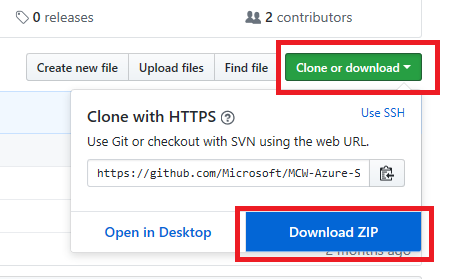
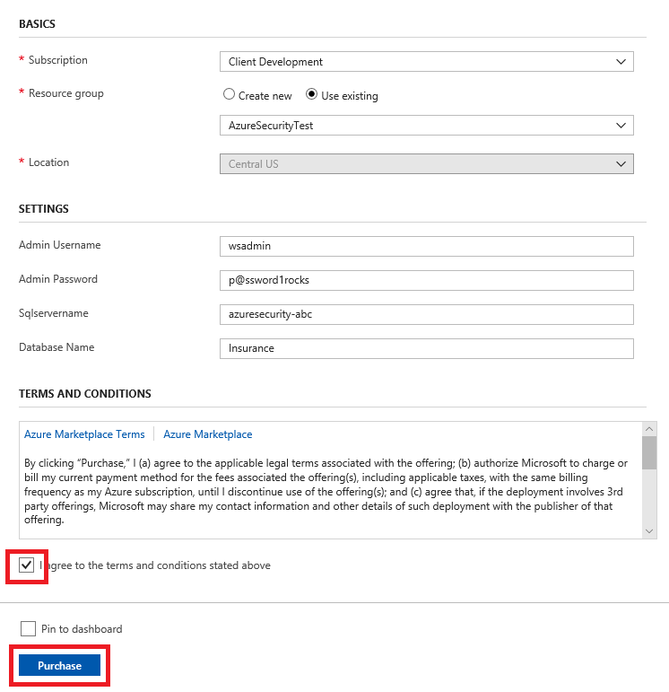
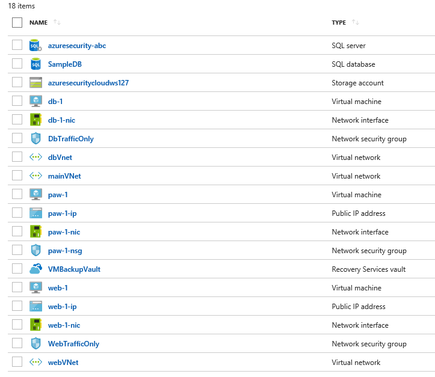
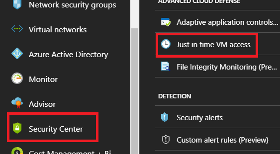
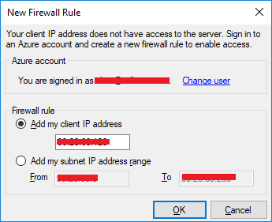

# Secure data PoC starter artifacts

> **TODO:** the ARM template contains the following path: https://github.com/givenscj/mcw-azure-security/blob/master/Scripts/Install_IIS.zip?raw=true. This needs to be updated to the path to [./Scripts/Install_IIS.zip](./Scripts/Install_IIS.zip) once this repo has been set up in its final location on GitHub.

These starter artifacts provided by Contoso might help you accelerate your PoC efforts for secure data.

## What the starter contains

- ARM template that creates the following:
  - One storage account
  - Three virtual networks
  - Three network security groups
  - Three virtual machines (db-1, web-1, paw-1)
    - IIS is installed on web-1 via a DSC script from the GitHub repository
  - One SQL Azure Server
  - One Azure Key Vault
- Insurance API source code
- Insurance.bacpac file for SQL database

## Starter setup

Setup will take around **30 minutes** to complete. What you need to get started is the following:

- Microsoft Azure subscription must be pay-as-you-go or MSDN
  - Trial subscriptions will not work
- A machine with the following software installed:
  - Visual Studio 2017
  - SQL Management Studio 2017

### Task 1: Download GitHub resources

1.  Open a browser window to the GitHub repository that contains the starter artifacts

2.  Select **Clone or download**, then select **Download Zip**

    

3.  Extract the zip file to your local machine. Browse to the `\Starter-artifacts\resources\secure-data-starter\` directory. You should now see a set of folders:

    

### Task 2: Deploy resources to Azure

1.  Open your Azure Portal

2.  Select **Resource groups**

3.  Select **+Add**

4.  Type a resource group name, such as **azsecurity-\[your initials or first name\]**

5.  Select **Create**

6.  Select **Refresh** to see your new resource group displayed and select it

7.  Select **Automation Script**, and then select **Deploy**

    

8.  Select **Build your own template in the editor**

9.  In the extracted folder, open the **\\Scripts\\template.json**

10. Copy and paste it into the window

11. Select **Save**, you will see the dialog with the input parameters. Fill out the form:

    a. Subscription: select your **subscription**

    b. Resource group: Use an existing Resource group, or create a new one by entering a unique name, such as **azsecurity-\[your initials or first name\]**

    c. Location: Select a **location** for the Resource group. Recommend using East US, East US 2, West Central US, or West US 2.

    d. Modify the **sqlservername** to be something unique such as "azsecurity-\[your initials or first name\]"

    e. Fill in the remaining parameters, but if you change anything, be sure to note it for future reference

    NOTE: User Object Id is meant to be the object id of a user that will be added as an administrator to an Azure Key Vault instance. You can type anything here but the permission assignment with fail in the ARM template later unless it is a valid Azure Active Directory User Object Id. You can find your object id by opening a new Azure portal window and navigating to the Azure Active Directory blade, select **Users**, search for your user account, select it, in the window you will see the **Object ID** field. Click the copy link, then paste the value into the template object user id text box.

    f. Check the **I agree to the terms and conditions stated above** checkbox

    g. Select **Purchase**

        

12. The deployment will take 15-30 minutes to complete. To view the progress, select the **Deployments** link, then select the **Microsoft.Template** deployment.

    

    h. As part of the deployment, you will see the following items created:

        -   One storage account

        -   Three virtual networks

        -   Three network security groups

        -   Three virtual machines (db-1, web-1, paw-1)

            -   IIS is installed on web-1 via a DSC script from the GitHub repository

        -   One SQL Azure Server

        -   One Azure Key Vault

            

## How to use the starter

### Task 1: Setup virtual machine with JIT

1.  In a browser, navigate to your Azure portal (<https://portal.azure.com>)

2.  Select **Security Center,** then select **Just in time VM access**

    

    **NOTE:** Your subscription may not be set up with the **Standard** tier; if that is the case then do the following:

    - Select **Security Policy**

    - Expand the first node to show your subscriptions, select the subscription

    - Toggle the **Inheritance** setting to **Unique**

    - Select the **Standard** tier

    - Select **Save**, note that it may take a few minutes for everything to "light up"

    - Select **Just in time VM access**

3.  Select the **Recommended** tab, and then check the checkbox to select all the virtual machines, and then select the **Enable JIT on 3 VMs** link

> **NOTE:** It could take up to 10 minutes for new VMs to show up if you upgraded to standard tier security. Also note that it is possible new VMs display in the **No recommendation** tab until a backend process moves them to the **Recommended** tab.

4.  In the configuration window that opens, review the settings, then select **Save**

    

    You should now see the states change to **Resolved**

### Task 2: Perform a JIT request

1.  Select the **Configured** tab. You should now see all the machines listed.

2.  Select the **paw-1** virtual machine, and then select **Request Access**

    

3.  For each of the ports, select the **On** toggle button, notice how the default IP settings is **My IP**

    

4.  At the bottom of the dialog, select **Open ports**. You should now see the **APPROVED** requests have been incremented and the **LAST ACCESS** is set to **Active now.**

    

5.  Select the ellipses, then select **Activity Log**, you will be able to see a history of who requests access to the virtual machines

    

6.  In the Azure Portal main menu, select **Network Security Groups**, then select **paw-1-nsg**

    

7.  Select **Inbound security rules.** You should now see a set of inbound security rules set up by JIT Access

    

### Task 3: Setup the database

1.  Switch to your Azure portal, select **More Services** then select **SQL Servers**

    

2.  Select the **Azure SQL** database server you created using the Azure Manager template

3.  Select **SQL Databases**, then select the **SampleDB** database

    

4.  In the summary section, select the **Show database connection strings**

    

5.  Take note of the connection string for later in this lab, specifically the **Server** parameter:

    

6.  Open **SQL Server Management Studio**

7.  Enter the database server name from above

8.  Enter the username and password used from the Azure Template deployment (**wsadmin** - **p\@ssword1rocks**)

    > **NOTE:** If you changed the username and password in the ARM template deployment, use those values instead

    

9.  Select **Connect**, in the **New Firewall Rule** dialog, select **Sign In**

10. Sign in as your Azure tenant admin

11. In the dialog, select **OK**, notice how your IP address will be added for connection

    

12. Right-click **Databases**, and select **Import Data-tier Application**

    

13. In the Introduction dialog, select **Next**

14. Select **Browse**, navigate to the extracted **Database** directory, and select the **Insurance.dacpac** file

    

15. Select **Open**

16. On the **Import Settings** dialog, select **Next**

17. On the **Database Settings** dialog, select **Next**

> **NOTE:** If you get an error, close and re-open SQL Management Studio try the import again. If that does not work, you may need to download the latest SQL Management Studio from [here](https://docs.microsoft.com/en-us/sql/ssms/download-sql-server-management-studio-ssms?view=sql-server-2017). In some instances the latest version may not work, version 17.3 is known to deploy the package properly. You should also be aware that bacpac files exported from some SQL Server instances cannot be deployed to Azure SQL Servers. We have also included a .bak file of the Insurance database that you can use to restore from.

18. Select **Finish** and the database will deploy to Azure

19. Once completed, select **Close**

    

20. In **SQL Management Studio**, select **File-\>Open-\>File**

    

21. Browse to the extracted GitHub folder, select the **\\Hands-on lab\\Database\\00_CreateLogin.ps1** file

22. Ensure that the **master** database is selected

23. Run the script to create a login called **agent**

24. Browse to the extracted folder, select the **\\Hands-on lab\\Database\\01_CreateUser.ps1** file

25. Ensure that the **Insurance** database is selected

26. Run the script to create a non-admin user called **agent**

### Task 4: Test the web application solution

1.  In the extracted directory, double-click the **/WebApp/InsuranceAPI/InsuranceAPI.sln** solution file, and Visual Studio will open

2.  In the **Solution Explorer**, navigate to and double-click the **web.config** file to open it

    

3.  Update the web.config (line 72) to point to the **Insurance** database created in Task 2. You should only need to update the server name to point to your Azure SQL Server.

    

4.  Run the **InsuranceAPI** solution and press **F5**

5.  In the browser window that opens, browse to [http://localhost:portno/api/Users](http://localhost:portno/api/Users) you should see a json response that shows an unmasked SSN column

> **NOTE:** Depending on your browser, you may need to download to view the json response.

